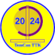

# TemCon_3
The latest addition to our Python Program collection, expanding on TemCon TTK, TemCon TTK 3 utilizes the OpenWeatherMap API to provide a Live Weather Reporting Temperature Conversion tool written in  Python utilizing the  Pillow Library, MessageBox and Requests. TemCon TTK 3 offers a Live Weather Reporting with a Selective Scale Option, Live Weather Reporting with Manual Temperature Conversion option. Using the OpenWeatherMap API, the program will convert temperatures in manual mode that include Kelvin Celcius, Fahrenheit and Rankine, in live mode, the program will convert into Kelvin, Fahrenheit and Rankine and Celcius, scale selection for personalized display.

For instructions on how to setup TemCon TTK 3 goto https://dashwoorkz.ca/

All Rights Reserved - Without Prejudice 
dashWoorkz Sovereign Society 
Managing Director: Dash: La Londe 
Software Program: TemCon TTK 3

Description: 
Temperature Conversion tool, converts Celcius, Kelvin, Fahrenheit and Rankine, Real-time current weather reporting using Openweather Map API, selective scale display, Manual and Live Mode.
TemCon TTK 3 is an updated version 0f TemCon TTK with the addition of a Splash Screen and with minor editing adjustments and additional documentation, and new functionality that provides selective scale display.

About dashWoorkz Sovereign Society
The dashWoorkz Sovereign Society is a family organization, Managing Director :Dash: La Londe works to develop products for the Raspberry Pi, develops Web Components and is currently designing a series for the Web called Web Design Made Easy, we are building a web based company that provides a variety of services in the form of physical and digital products.

dashWoorkz Sovereign Society also works to help those in need by providing woven hats and socks to single mothers
in the neighbourhood, our Community Support Director Jeanette-Elizabeth creates a variety of woen and knotted apparel for
seniors, mothers and children alike, Jeanette-Elizabeth is also a fine artist and we ware working to develop an
online E-Commerce presence in order to offer her works to the public.

Lord :Dash: La Londe
dash@dashwoorkz.ca - Managing Director
dashwoorkz@dashwoorkz.ca - dashWoorkz Sovereign Society
